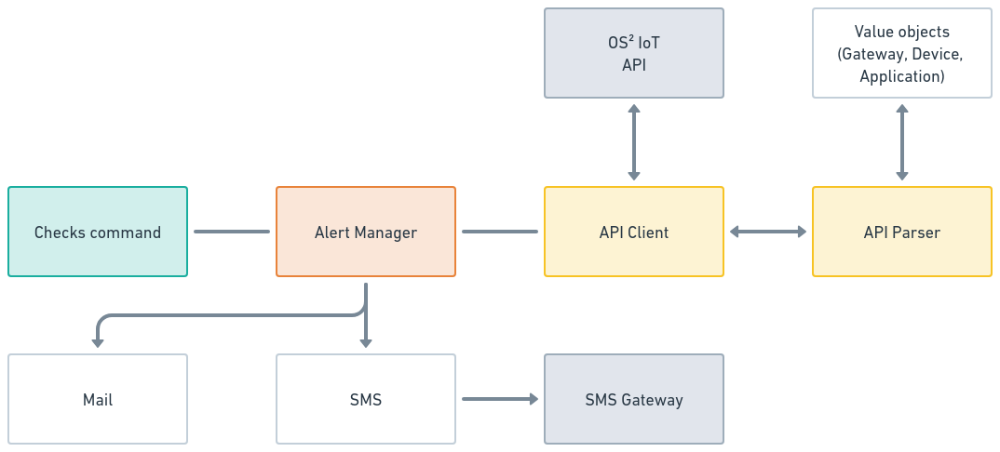

# IoT Alert Manager

This is a Symfony command-line tool that can be used to set up alerts (sending
both emails and text messages) based on the last time a specific gateway or
device was active (sent data).

For instance, if a device that regularly sends data stops communicating, this
tool will detect the inactivity. Once the absence of data is noticed, it will
automatically send out notifications to inform you. This can be particularly
useful for monitoring the status of critical devices and ensuring they are
functioning properly. It helps in quickly identifying and addressing potential
issues, thereby minimizing downtime and maintaining smooth operations.

## Overview

This application communicates with the [OS² IoT](https://www.os2.eu/os2iot) API
to look up gateways, applications, and connected devices. The gateways and
applications are filtered based on their status (default: in-operation and
project).

This project does **not** have a user interface but uses `tags` on gateways and
`metadata` on devices to determine whom to alert and when not to send alerts.
This decision has been made to keep the application relatively simple and to
maintain IoT configuration in a single place (within OS² IoT).



The diagram above outlines the different services and how they are related in
this application.

The required data retrieved from the IoT API is converted into value objects to
ensure type safety and stability. This process also helps in detecting and
logging data anomalies.

The application uses Symfony Mailer to send emails and the
SMS2Go [API](https://pushapi.ecmr.biz/docs/index.html?url=/swagger/v1/swagger.json)
gateway to send SMS messages. Another gateway can be implemented using the
`SmsClientInterface` and by overriding the injection in `service.yml`.

## Metrics

This application provides metrics that can be used for observability in
Prometheus with Grafana. The metrics also include information on exceptions
encountered during execution. These metrics are available at `/metrics`, though
this path can be reconfigured if needed.

## Logs

The application outputs basic log information and errors to standard output and
error. These logs can be sent to [Loki](https://grafana.com/oss/loki/) when running e.g. Docker.

## Configurations

The application's configuration variables can be found in the `.env` file and
can be overridden using the `.env.local` file. For more information, refer
to [Overriding Environment Values via .env.local](https://symfony.com/doc/current/configuration.html#overriding-environment-values-via-env-local)
in Symfony's documentation.

In the next section, we highlight the configurations that you should or may need
to change to get the alert manager working properly.

### API access configuration

To access the IoT API and the SMS gateway, the following settings need to be
obtained.

* **API_CLIENT_KEY** (API key for the OS² IoT API)
* **SMS_GATEWAY_ID** (Identifier used at sms2go)
* **SMS_GATEWAY_TOKEN** (Token to access the sms gateway)
* **SMS_DRY_RUN** (If set to true SMS will not be sent)

### Status filter

This is used when commands are executed with the `--filter-status` option to
filter out applications and devices that have one of the statuses specified in
this comma-separated list.

Value available are: `NONE`, `IN-OPERATION`, `PROTOTYPE`, `PROJECT` and `OTHER`

* **ALERT_STATUSES** (default: `IN-OPERATION,PROJECT`)

### Gateway alert configuration

The contact phone and email are not required information on gateways. If these
values are not set, the following variables will be used as a fallbacks.

* **ALERT_GATEWAY_FALLBACK_MAIL**
* **ALERT_GATEWAY_FALLBACK_PHONE**

### Device alert configuration

This application utilizes metadata on the device to get contact information.
Since metadata consists of free-text key/value pairs, you can use the
configuration below to specify which keys should correspond to different contact
data.

* **ALERT_DEVICE_METADATA_MAIL_FIELD** (default: `email`)
* **ALERT_DEVICE_METADATA_PHONE_FIELD** (default: `phone`)

You can also modify the "last seen" time (which is used to trigger an alert) for
each device using a metadata field. If not provided, a fallback value will be
used.

This is always given in seconds.

* **ALERT_DEVICE_FALLBACK_LIMIT** (default: `86400` - 24 hours)
* **ALERT_DEVICE_METADATA_THRESHOLD_FIELD** (default: `notification_threshold`)

If contact data is not found in the metadata configuration from above, these
variables below can be used to define fallbacks.

* **ALERT_DEVICE_FALLBACK_MAIL**
* **ALERT_DEVICE_FALLBACK_PHONE**

### Silence alerts

This application does not maintain any state, so it will send the same alert
every time it is executed until the problem is resolved. There are two ways to
silence or acknowledge an alert:

1) Change its status to one not in `ALERT_STATUSES`.
2) Set a tag on a gateway or on as metadata on devices with an until date.

* **ALERT_GATEWAY_SILENCED_TAG** (default: `silenced_until`)
* **ALERT_DEVICE_METADATA_SILENCED_FIELD** (default: `silenced_until`)
* **ALERT_SILENCED_TIME_FORMAT** (default: `d-m-y\TH:i:s` eg. 18-09-24T16:00:00)

### Templates (mail and SMS)

All email and SMS content is formatted using Twig templates. To change the
wording, you can copy the templates from the `/app/templates` directory within
the `phpfpm` container, modify them, and then override the original templates by
mapping the updated versions into the container. Doing this way will not alert
the application code and keep git clean.

### Fallback order

This is the order of contact information fallback order.

**Gateways**:

* Command override
* Gateway contact information
* Gateway fallback mail (.env)

**Devices**:

* Command override
* Device metadata field
* Application contact mail
* Device fallback mail (.env)

## Commands

If using Docker, commands are executed in the `phpfpm` container by executing
`bin/console`. All commands have `--help` option which will output text
explaining all the options and what they are used for.

For example, list all applications filtered on the configured statuses:

```shell
docker compose exec phpfpm bin/console app:api:applications --filter-status
```

The primary command for the application is `app:alert:checks`, which runs the alert
manager service. This command provides numerous options to modify its behavior;
use `--help` to view all available options.

Below are three examples demonstrating basic usage. The first example checks all
gateways, filtered based on the configured statuses, and disables SMS
notifications.

```shell
docker compose exec phpfpm bin/console app:alert:checks --only-gateways --filter-status --no-sms
```

The next command checks applications and thereby all devices found in the
applications.

```shell
docker compose exec phpfpm bin/console app:alert:checks --only-applications
```

This command executes all tests and covers both gateways, applications (and
thereby devices).

```shell
docker compose exec phpfpm bin/console app:alert:checks --all
```

### API consumption test commands

Collection of commands to test and see information extracted from the IoT SPI.

* `app:api:application` (Get a single application from API server)
* `app:api:applications` (Get applications from API server)
* `app:api:device` (Get device from API server)
* `app:api:gateways` (Get gateways from API server)

### Mail/Sms test commands

Two commands to test mails and SMS integration.

* `app:mail:test` (Send test e-mail)
* `app:sms:test` (Send test SMS)

## Slutbrugervejledning :denmark:

Applikationers og Gateways' alarmering slås til ved at markere Status som værende *I drift* eller *Projekt*, hvorimod
*-*, *Prototype* eller *Andet* ikke forårsager alarmer. Desuden respekteres *Slutdato*.

### Ingen alarmer frem til en dato

Hvis en Enhed, Applikation eller Gateway ikke skal afgive alarmer frem til en bestemt dato:

1. For Applikationer og disses Enheder: I OS2IOTs brugerinterface klikker man *Rediger* og vælger *Tilføj
   metadatarække*. Der skal så angives en metadatarække med *Nøgle*: `silenced_until` og *Værdi* på formen
   `31-12-25T00:00:00`.
2. For Gateways skal man under *Gateway tags* indtaste på formen `{"silenced_until":"31-12-25T00:00:00"}`.

### Én enhed med særlig ansvarlig

Hvis enhederne i en Applikation ikke har samme ejer/ansvarlige, så kan man for en `Enhed` klikke `Rediger` og vælge
`Tilføj metadatarække`. `Nøgle` skal være `email` og `Værdi` skal være på formen `user@domain.example`.
Der kan for SMS-varsling tilsvarende sættes nøglen `phone` med værdien på formen `+4570241207`.
